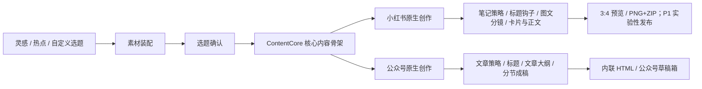

# 内容创作工作台：决策摘要与文档导航

> 版本：v1.1  
> 方案日期：2026-08-18  
> 适用范围：Web MVP，后续扩展移动端、小红书与微信公众号发布通路

## 1. 一句话定位

一个以“灵感事实库”为起点、以 AI 辅助而非替代创作者、用同一份核心内容骨架分别生成小红书与公众号原生作品的多模态内容工作台。

## 2. 对现有思路的总体判断

现有思路的**产品方向成立**，调研报告中的核心原则也基本合理：人在回路、先选题与结构再成稿、音频先转写、原图优先、AI 生图为辅、双平台分别排版、发布前人工确认。

但需修正三类问题：

1. **把运营经验写成平台硬规则**：例如固定字数、固定图片数、Cookie 固定有效期、固定处罚期限等，不应作为系统规则。
2. **把技术可行等同于平台授权**：`xiaohongshu-mcp` 可实现发布，不代表它是小红书官方开放能力；应定位为有风险的实验性本地发布桥。
3. **把通用长文误当成双平台共同中间态**：Code-2 当前从长文直接做卡片，但小红书需要视觉分镜优先、公众号需要文章结构优先。应补齐“素材装配—选题确认—核心内容骨架”，再分流到两个平台的原生创作路径；Code-2 只承接小红书分镜、渲染和导出能力。

## 3. 本方案的关键产品决策

### 3.1 用“单一核心事实源 + 双平台原生创作”



共享的是主题、受众问题、核心主张、事实、Evidence、案例、原始素材和内容禁区；不强制共享标题、开头、段落顺序、图文分镜、语气、CTA、标签和排版。两个平台稿都引用同一个 `ContentCore` 版本，但分别原生生成和独立编辑。

默认流程不再要求先写一篇平台中性的完整“母稿”。完整文章导入或“先写长文再改编”保留为高级入口：系统先从已有文章提取核心内容骨架，再创建平台稿。这里的“平台适配”只负责尺寸、字段、HTML 内联样式、图片上传映射、发布 payload 与合规检查，不承担主要内容重写。

### 3.2 灵感类型是“轻量属性”，不阻塞快速记录

- 用户可选择类型，也可跳过。
- 系统可给出 AI 建议类型，但不能悄悄覆盖用户选择。
- 类型采用可扩展标签体系，而不是首版就设计复杂分类树。
- 所有素材保留原件、来源、时间和处理状态。

### 3.3 日期是主导航，星云是探索视图

- MVP 用“年/月/日滚轮 → 单一日期 → 当日白板”作为确定、可理解的主路径。
- 图三式星云聚类适合后续做跨日期探索，不替代日期白板。
- 日白板中的每条灵感是一张贴片，可多选进入创作。

### 3.4 热点 Skill 不是 LLM，也不是数据源

```text
数据源/API/RSS/网页
→ Skill/Adapter：获取、解析、归一化
→ Hotspot Store：保存快照、来源、抓取时间、证据
→ LLM：聚类、摘要、相关性分析、选题建议
→ 人：确认是否使用
```

卡兹克 AIHot skill 的公开定义显示，它通过 `aihot.virxact.com` 的公开接口获取热点列表和详情，并可筛选 AI/科技类来源。它适合作为首个热点适配器，但应在正式使用前确认服务稳定性、许可、限流和数据来源条款。

### 3.5 AI 图片不是默认产物

MVP 优先级：

1. 用户原图的整理、排序、裁切建议；
2. 模板化信息卡、步骤卡、金句卡；
3. 可选的非事实性封面/概念插图；
4. 不默认生成可能伪造真实经历、测评、探店或人物现场的图片。

### 3.6 发布分为正式通道和实验通道

- **公众号**：优先走官方素材与草稿箱 API；账号资格、接口权限和字段约束必须在连接时动态检测。
- **小红书**：MVP 先保证 PNG/ZIP 发布包可靠导出；P1 再灰度接入 `xiaohongshu-mcp` 本地浏览器/桌面发布桥，避免云端托管用户 Cookie，且发布前必须由用户确认。

## 4. MVP 边界

### MVP 必做

- 首页两个主操作：记录灵感、开始创作
- 文字、图片、音频上传；音频异步 ASR
- 年/月/日选择并最终落到单日白板
- 灵感贴片、多选、搜索与基础类型标签
- AIHot 热点列表、详情、快照、时效与来源
- 灵感与热点相关性解释
- 自定义选题、候选选题、核心内容骨架及事实/Evidence 确认
- 从同一核心内容骨架创建小红书与公众号两份平台原生稿
- 小红书分镜/卡片预览与公众号文章/HTML 预览
- 小红书卡片导出包；公众号 HTML/草稿包
- 发布前人工确认、版本历史、失败可恢复

### MVP 不做

- 自动定时群发
- 无人值守批量发布
- 复杂灵感星云作为主导航
- 默认 AI 重绘所有图片
- 多热点源市场或任意用户代码执行
- “一键生成后直接发布”
- 复杂块级三方合并；MVP 采用“新版本 + 差异预览 + 用户选择”
- 强制所有用户先生成完整通用长文再进入平台分支
- 把未经核验的图片数、字数、发布时间当成硬校验

## 5. 推荐的文档阅读顺序

1. [01-市场调研报告审计与修订建议.md](./01-市场调研报告审计与修订建议.md)
2. [02-产品需求与信息架构方案.md](./02-产品需求与信息架构方案.md)
3. [03-交互流程与视觉设计规范.md](./03-交互流程与视觉设计规范.md)
4. [04-内容创作与多模态AI方案.md](./04-内容创作与多模态AI方案.md)
5. [05-双平台排版与发布技术方案.md](./05-双平台排版与发布技术方案.md)
6. [06-系统架构数据模型与研发计划.md](./06-系统架构数据模型与研发计划.md)
7. [07-MVP验收标准与用户研究计划.md](./07-MVP验收标准与用户研究计划.md)

## 6. 证据等级说明

本组文档统一采用以下等级：

- **A｜已核验事实**：来自官方文档、目标项目源码/README 或本地实际代码。
- **B｜高可信工程判断**：基于成熟工程实践，但仍需结合账号和环境验证。
- **C｜产品假设**：需要通过用户访谈、原型测试或灰度数据验证。
- **D｜待核验外部约束**：平台政策、接口权限、限额或第三方服务稳定性可能变化。

## 7. 已核验参考

- 本地调研：[创作流程市场调研报告.md](../创作流程市场调研报告.md)
- 本地原型：[Code-2](../Code-2/)
- [卡兹克 AIHot skill](https://github.com/KKKKhazix/khazix-skills/blob/main/aihot/SKILL.md)
- [AIHot Agent 文档](https://aihot.virxact.com/agent-docs)
- [xiaohongshu-mcp](https://github.com/xpzouying/xiaohongshu-mcp)
- [doocs/md 微信 Markdown 编辑器](https://github.com/doocs/md)
- [微信公众平台开发文档](https://developers.weixin.qq.com/doc/offiaccount/Getting_Started/Overview.html)

> 平台接口、权限和政策会变化。本文中的端点设计是实现方向，不替代上线时对官方文档、实际账号权限和第三方项目最新版本的再次核验。
