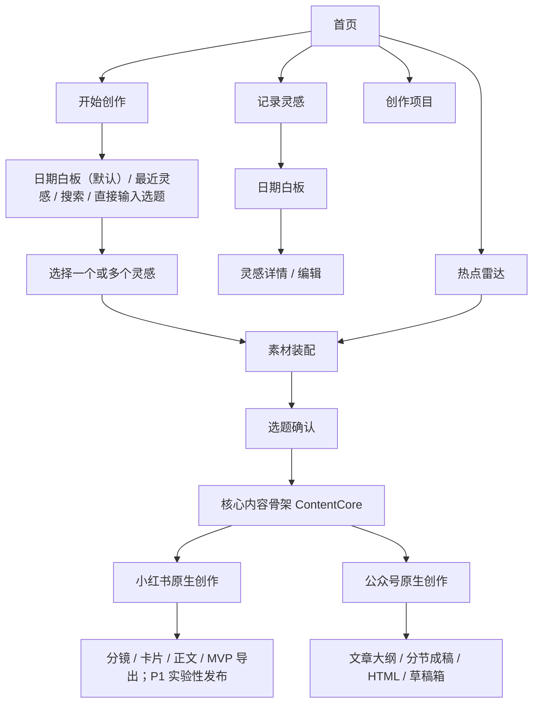
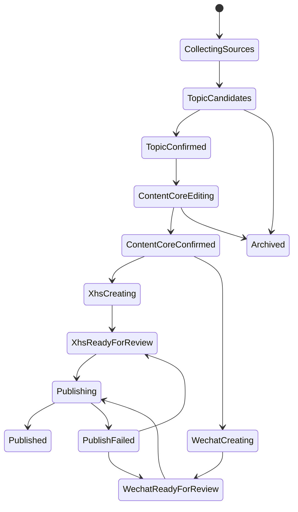

# 产品需求与信息架构方案

## 1. 产品目标

### 1.1 目标用户

首版聚焦同时经营小红书和公众号、已有零散素材但缺少稳定创作流程的个人创作者或 1–3 人内容团队。

### 1.2 核心 JTBD

> 当我随时产生文字、图片或语音灵感时，我希望快速保存且不打断思路；当我要创作时，我能重新找到这些灵感，把它们与合适热点组合，确认选题与核心内容，再分别形成适合小红书和公众号的原生可发布版本。

### 1.3 北极星指标

不以“AI 生成次数”为核心，而以：

- **有效创作完成率**：开始创作后形成至少一个可发布平台稿的项目比例；
- **灵感转化率**：记录后 30 天内被引用到选题/内容的灵感比例；
- **从选题确认到可发布预览的中位耗时**；
- **发布前人工修改保留率**：反映系统是否尊重创作者控制，而非追求零编辑。

## 2. 产品原则

1. **记录优先**：记录时尽量少填字段，整理可稍后完成。
2. **自由但可恢复秩序**：白板允许轻度空间表达，但排序、筛选和搜索随时可用。
3. **AI 给建议，不替用户作决定**。
4. **所有生成都有来源、版本和撤销**。
5. **一份核心内容骨架，两条平台原生创作路径**。
6. **发布是高风险动作，必须明确确认和可诊断**。
7. **平台经验是建议，不冒充硬规则**。

## 3. 信息架构



全局一级导航建议：

- 工作台
- 灵感库
- 热点雷达
- 创作项目
- 发布记录
- 设置/连接

首页仍以两个大按钮作为视觉主角；全局导航应低强调，避免破坏初始体验。日期白板是“开始创作”的默认主路径，但不是唯一入口：最近灵感、全局搜索和直接输入选题用于降低已有明确方向用户的绕行成本。

## 4. 页面与功能需求

### 4.1 首页

**目的**：让用户在 2 秒内判断下一步。

核心元素：

- 品牌标题与一句轻量提示；
- “记录灵感”大按钮；
- “开始创作”大按钮；
- 次入口：热点雷达、最近项目、今日灵感数；
- 背景采用浅色网格与低饱和星云光晕。

行为：

- `记录灵感` 打开快速记录抽屉/全屏面板；
- `开始创作` 进入日期选择；
- 支持键盘快捷键，例如 `N` 快速记录，但不得与输入框冲突。

### 4.2 快速记录灵感

字段：

| 字段 | 必填 | 说明 |
|---|---:|---|
| 文字内容 | 否 | 支持纯文本/轻量 Markdown |
| 图片 | 否 | 多张上传，显示进度和失败重试 |
| 音频 | 否 | Web MVP 上传；移动端后续录制 |
| 灵感类型 | 否 | 用户选择或 AI 建议 |
| 自定义标签 | 否 | 可多选 |
| 记录时间 | 是 | 默认当前时间，可回改日期 |
| 来源备注 | 否 | 自己想到、链接、会议、书籍等 |

校验：文字、图片、音频至少有一种。类型不能成为保存阻断项。

保存后立即生成灵感卡；OCR、图片理解、ASR 和自动标签异步执行。用户可以关闭页面，不等待处理完成。

处理状态：

- `uploaded`
- `processing`
- `ready`
- `partial_failed`
- `failed`

失败时保留原件，允许重试单个处理步骤。

### 4.3 日期选择器

用户明确要求年、月、日都能滚动，最终落到具体单日。建议采用三段式滚轮，但避免无限滚动带来的迷失。

交互：

1. 默认聚焦最近有灵感的日期；
2. 年、月、日三个滚轮联动；
3. 切换年月后，日列表按真实天数更新；
4. 顶部显示完整日期，例如“2026 年 8 月 17 日，星期一”；
5. 有灵感的日期显示小光点与数量；
6. 确认按钮只有在完整日期有效时可用；
7. 提供“今天”和“最近有灵感”快捷入口，但结果仍是单日。

可访问性：滚轮必须同时支持键盘方向键、直接输入日期和屏幕阅读器；不能只依赖拖拽。

### 4.4 单日灵感白板

**主目标**：回忆当日思路、选择素材，不是无限画布软件。

布局：

- 顶部：日期、上一天/下一天、搜索、筛选、列表/白板切换；
- 中央：有限边界白板，灵感贴片轻微错落；
- 底部浮动操作栏：已选数量、加入创作、批量标签；
- 右侧详情抽屉：原文、转写、图片、标签、处理状态、引用记录。

贴片内容：

- 时间；
- 类型图标；
- 文本摘要；
- 图片缩略图或音频波形；
- AI 建议标签以虚线样式显示；
- 已被创作引用的状态。

秩序控制：

- 默认使用确定性的自动布局；
- 卡片仅允许小范围偏移和 ±2° 内旋转；
- “整理白板”可恢复自动布局；
- 支持按时间、类型、处理状态排序；
- 用户移动位置需保存；
- 贴片重叠超过阈值时自动错位，不允许完全遮挡。

多选：点击复选、框选、Shift 连选；移动端后续采用长按进入多选。

### 4.5 灵感库

日期白板之外仍需一个效率视图：

- 全局搜索；
- 日期范围；
- 类型与标签；
- 仅看未使用/已使用；
- 处理失败；
- 卡片/列表视图。

图三式“星云探索”放入 P2：按语义簇、标签或项目关系进行视觉探索，但必须提供列表回退。

### 4.6 热点雷达

MVP 仅有“AI 热点”来源，先不做关键词搜索。

页面结构：

- 左侧来源栏：AI 热点；
- 顶部：最后更新时间、刷新、抓取状态；
- 主列表：标题、来源、排名/热度证据、源发布时间、抓取时间、摘要、过期提示；
- 详情：原文摘要、来源链接、关联灵感建议、加入创作；
- 未来扩展：增加来源、启停、自定义 Skill。

热点状态：`fresh`、`aging`、`expired`、`source_unavailable`。时效阈值按来源配置，不写死为全局规则。

AIHot 接入说明：公开 skill 契约包含列表与详情接口，支持 AI/科技过滤和分类浏览。产品层需要将其输出转换为统一 `HotspotItem`，不得让 UI 直接依赖第三方 JSON 字段。

### 4.7 开始创作：素材装配

允许四种入口：

1. 默认通过“年/月/日滚轮 → 单一日期 → 当日白板”选择一个或多个灵感；
2. 从最近灵感或全局搜索添加素材；
3. 从热点雷达选择热点；
4. 直接输入自定义选题。

日期仍是首页“开始创作”的主要入口和情境回忆方式，但不强制已有明确选题的用户先经过日期。无论从何处进入，最终都进入同一个素材篮；若从日期进入，项目保留 `primary_date`，后续跨日期补充不改变主日期。

素材篮展示每项的来源、处理状态、使用权限和当前选择片段。ASR/OCR 未完成时提示用户等待、手工补充摘要或仅使用已就绪内容。完成装配后可直接生成候选选题，也可先添加热点。

### 4.8 相关性分析

当同时存在灵感和热点时自动分析，但不阻断创作。

展示维度：

- 语义相关性；
- 受众相关性；
- 账号定位相关性；
- 时效性；
- 独特观点空间；
- 总体等级：高/中/低；
- 置信度；
- 3 条依据与 1 条冲突/风险。

可以显示 0–100 辅助分，但必须解释这是启发式评分，不是客观事实。低分仍可“继续组合”。

### 4.9 选题工作台

输入：素材篮、账号画像、目标受众、用户自定义要求，以及可选的平台偏好。目标平台可以帮助 AI 推荐角度，但选题阶段不强制提前锁死；用户可在确认核心内容后选择一个或两个平台。

输出 3–5 个候选选题，每个包含：

- 选题句；
- 核心承诺；
- 目标读者；
- 独特角度；
- 使用哪些素材；
- 事实/版权风险；
- 更适合的平台；
- 可编辑标题方向。

用户可以确认、合并、改写或直接自定义选题。

### 4.10 核心内容骨架

选题确认后，系统自动生成可编辑的“创作要点”卡片；用户界面可使用“创作要点/核心内容”，产品与研发文档统一称为 `ContentCore`（核心内容骨架）。它不是空白表单，也不是完整文章，而是 AI 根据素材与选题整理出的创作共识。

应包含：

- 主题、目标读者和读者问题；
- 核心承诺、核心主张与关键观点；
- 事实、数字、Evidence 引用和案例；
- 可用文字、音频转写、原图和热点快照；
- 待核验内容与证据缺口；
- `mustInclude`、`mustAvoid` 和内容边界。

不应包含：

- 完整公众号文章或完整小红书正文；
- 平台专属标题、开头钩子和段落顺序；
- 小红书图文分镜、公众号文章大纲；
- CTA、话题标签和最终排版。

交互采用结构化卡片而非要求用户从零填表：用户可编辑、删除、补充和锁定字段，也可用自然语言要求“不要强调效率”“加入某段语音”“这个数字先不要使用”。每项关键事实可查看来源；重新生成必须创建新版本且不覆盖锁定项。

### 4.11 平台原生创作

用户确认核心内容骨架后，选择一个或两个平台。两个平台稿引用同一 `ContentCore` 版本，分别形成 `XhsNativeDraft` 与 `WechatNativeDraft`，但各自生成、独立编辑，不要求共享标题、顺序、语气或 CTA。

#### 小红书原生创作

```text
ContentCore
→ 笔记策略
→ 标题候选 / 开头钩子
→ 图文分镜
→ 卡片文案与素材装配
→ 短正文与话题
→ 3:4 预览
→ PNG/ZIP 导出；P1/Phase 4 可进入实验性发布
```

关键能力：卡型与页序、原图/信息卡槽位、逐页锁定和局部再生成、真实溢出检查、标题/正文/标签与图片顺序确认。小红书不从完整长文按标题机械切图。

#### 公众号原生创作

```text
ContentCore
→ 文章策略
→ 标题候选
→ 文章大纲
→ 分节成稿
→ 全文编辑
→ Markdown/结构化内容转内联 HTML
→ 公众号草稿箱
```

关键能力：章节排序、分节生成与锁定、引言和结尾、图片位置与图注、主题排版预览、复制 HTML 或推送官方草稿箱。

平台适配仅位于成稿之后，负责字数/字段校验、图片尺寸、标签格式、HTML 内联样式、图片上传映射、发布 payload 与平台合规提示，不负责把一篇通用文章重写成另一种内容。

### 4.12 发布中心

显示：平台、项目、版本、连接状态、确认人、状态、外部 ID、错误、重试次数和时间。

状态建议：

```text
draft → validating → awaiting_confirmation → queued → publishing
→ succeeded | failed_retriable | failed_manual | cancelled
```

重新发布必须生成新的用户确认，不得沿用旧确认。

## 5. 创作项目状态机



项目允许只创建一个平台稿，也允许从同一 `ContentCore` 创建两个平台稿。平台稿记录 `sourceCoreVersion`、`syncStatus` 和 `userLockedPaths`；核心内容更新后，旧平台稿进入 `stale`，用户通过差异预览决定是否创建新版本。状态转换由服务端验证，不允许静默覆盖人工编辑或锁定路径。项目级状态只用于汇总整体进度；每个平台的创作、校验与发布状态，以 `platform_drafts` 和 `publication_jobs` 为准，因此一个分支成功、失败或暂未创建，不应错误改写另一分支的状态。

## 6. 权限与隐私

MVP 即使是单用户也应预留：`owner`、`editor`、`viewer`。

敏感信息：

- 公众号 AppSecret 仅服务端加密保存；
- 小红书 Cookie 不进入云端数据库；
- 音频、图片支持删除原件及派生数据；
- LLM 调用前按设置决定是否上传原图或仅上传结构化描述；
- 日志不得记录完整正文、Cookie、AppSecret 或 access token。

## 7. 产品范围优先级

| 阶段 | 能力 |
|---|---|
| MVP | 灵感记录、日期白板与辅助入口、AIHot、素材装配、选题、核心内容骨架、公众号原生文章与草稿箱、小红书原生分镜与 PNG/ZIP 导出 |
| P1 | 小红书本地实验发布桥、全局跨日期素材篮、账号画像、模板管理、团队协作、发布历史分析、移动 Web 拍照/录音 |
| P2 | 原生移动端、灵感星云、多热点 Skill 市场、内容效果回流、个性化策略、正式排期 |

## 8. 关键非功能需求

- 快速记录面板首屏可交互目标 < 1.5 秒；
- 文本保存采用本地暂存 + 服务端自动保存；
- 上传支持断点或至少单文件失败重试；
- 生成任务可离开页面，完成后通知；
- 所有 AI 结构化输出通过 schema 校验；
- 发布任务必须幂等；
- 核心编辑操作具备撤销、版本恢复；
- 关键页面满足 WCAG AA 的对比度和键盘操作要求。

视觉与交互细化见：[03-交互流程与视觉设计规范.md](./03-交互流程与视觉设计规范.md)。
