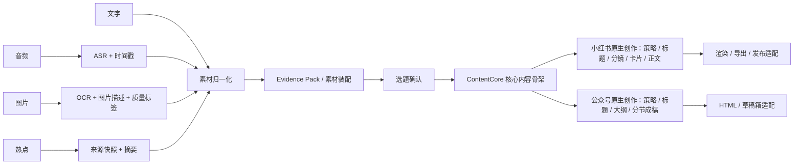
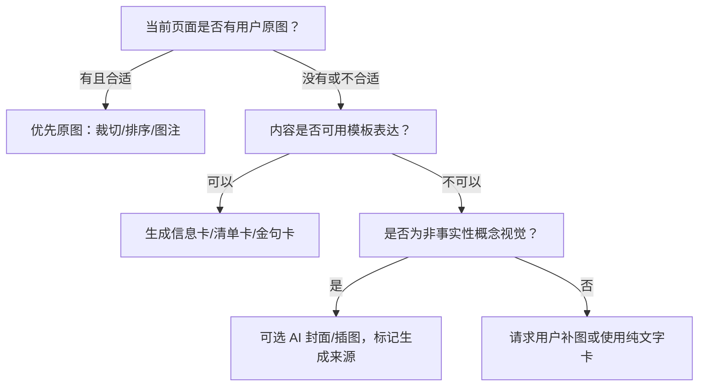

# 内容创作与多模态 AI 方案

## 1. 核心原则

LLM 不直接“吞掉所有素材然后写一篇文章”。可靠流程应先把不同模态转换成可检查、可追溯的中间层，再生成结构化结果。



## 2. 多模态素材处理

### 2.1 文字

保留两层：

- `raw_text`：用户原文，不被 AI 覆盖；
- `normalized_text`：去除明显转码问题、提取段落，但不改变事实。

可选派生：摘要、关键词、实体、语言、情绪、建议类型。所有派生字段都带模型版本和生成时间。

### 2.2 音频

流程：

1. 上传原文件并计算哈希；
2. 读取时长、格式、采样信息；
3. 异步 ASR；
4. 生成带时间戳片段；
5. 可选说话人区分；
6. 用户纠错；
7. 生成清理稿，但保留逐字稿；
8. 将经用户确认的转写加入 Evidence Pack。

数据结构：

```json
{
  "transcript_status": "ready",
  "language": "zh-CN",
  "segments": [
    {"start_ms": 0, "end_ms": 4200, "text": "……", "confidence": 0.91}
  ],
  "user_corrected": false,
  "model": "asr-provider/model-version"
}
```

低置信度片段应高亮，不能把清理后的文本冒充用户原话。ASR 失败不影响原音频保存。

### 2.3 图片

每张图保留：

- 原件和安全派生缩略图；
- EXIF 中允许保留的字段，默认去除敏感定位信息；
- OCR 文本；
- 图片描述/caption；
- 主体、场景、颜色、方向、分辨率、清晰度；
- 版权/来源备注；
- 是否允许用于发布、仅用于理解、或不发送给模型。

图片理解结果用于检索和写作，不替代原图。用户可纠正 AI 描述。

### 2.4 热点

热点进入创作时固定为一个不可变快照，至少包含：

- 原始标题；
- 来源和 URL；
- 源发布时间（可得时）；
- 抓取时间；
- 原始摘要/详情；
- AI 摘要；
- 热度证据；
- 快照哈希；
- 新鲜度状态。

若热点内容之后变化，旧项目仍引用原快照，用户可选择更新并重新分析。

## 3. Evidence Pack

Evidence Pack 是一次创作使用的素材清单，不把所有历史数据塞给模型。

```json
{
  "project_id": "...",
  "account_profile": {
    "positioning": "...",
    "audience": ["..."],
    "voice": ["真诚", "克制"]
  },
  "inspirations": [
    {
      "id": "ins_1",
      "recorded_at": "2026-08-17T09:42:00+08:00",
      "text": "...",
      "asset_refs": ["asset_1"],
      "user_tags": ["产品设计"]
    }
  ],
  "hotspots": [
    {"snapshot_id": "hot_1", "title": "...", "source": "...", "captured_at": "..."}
  ],
  "constraints": {
    "must_include": [],
    "must_avoid": [],
    "target_platforms": ["xiaohongshu", "wechat"]
  }
}
```

打包策略：

- 先去重与排序；
- 超过上下文预算时按用户选择、事实重要度和项目相关性裁剪；
- 摘要不能替代被引用的关键原文；
- 模型输出引用 Evidence ID，而不是生成不可追溯的“据说”。

## 4. Skill、热点源与 LLM 的分工

### 4.1 正确分层

| 层 | 职责 | 是否必须使用 LLM |
|---|---|---:|
| Source | API、RSS、网页或数据库提供原始数据 | 否 |
| Skill/Adapter | 定义参数、认证、抓取、解析、归一化 | 否 |
| Hotspot Store | 保存快照、来源、时间、去重键 | 否 |
| LLM Enrichment | 摘要、聚类、相关性、角度、风险提示 | 是/可选 |
| Human Decision | 判断是否用于创作 | 否 |

Skill 更像“工具使用说明 + 调用契约 + 适配代码”，而不是一个独立 AI。LLM 可以阅读 skill 描述并决定何时调用，但确定性的抓取、校验和存储应由程序完成。

### 4.2 AIHot 的首版接入

公开的 `aihot/SKILL.md` 说明：

- 热点列表：`GET https://aihot.virxact.com/api/public/hot`；
- 热点详情：`GET https://aihot.virxact.com/api/public/hot/{id}`；
- 支持分页、平台筛选、分类筛选；
- 可用 `category=ai` 获取 AI 与科技热点；
- 接口不需要 API Key 的公开说明来自该 skill 当前文档。

接入时仍要做：

- 5–10 秒超时；
- 退避重试和熔断；
- 原始响应版本化保存；
- 字段 schema 校验；
- 限流未知时保守缓存；
- 服务异常时展示上一次成功快照；
- 上线前确认服务条款、许可证和数据来源授权。

建议统一接口：

```ts
interface HotspotAdapter {
  id: string;
  version: string;
  capabilities: { list: boolean; detail: boolean; search: boolean };
  fetchList(input: HotspotQuery, ctx: AdapterContext): Promise<HotspotPage>;
  fetchDetail?(externalId: string, ctx: AdapterContext): Promise<HotspotDetail>;
  healthCheck(ctx: AdapterContext): Promise<AdapterHealth>;
}
```

不要允许用户上传任意代码成为 Skill。自定义来源在 P2 应采用受控 manifest、声明式 HTTP/RSS 连接器或沙箱运行。

## 5. 相关性评分设计

### 5.1 不只算语义相似度

灵感与热点词面相似并不等于值得创作。建议维度：

| 维度 | 权重初值 | 解释 |
|---|---:|---|
| 语义相关性 | 25% | 是否讨论相近问题 |
| 受众相关性 | 20% | 目标读者是否关心 |
| 账号定位 | 20% | 是否符合账号长期主题 |
| 独特观点空间 | 20% | 灵感能否增加个人经验/观点 |
| 时效性 | 15% | 当前热点是否仍值得跟进 |

权重是产品初值，不是科学定律，后续应允许按账号调整。

### 5.2 混合实现

1. 规则层检查热点是否过期、素材是否就绪；
2. Embedding/检索层计算语义接近度；
3. LLM 按 rubric 分维度输出理由；
4. 服务端校验 JSON schema；
5. 计算可解释总分；
6. 用户反馈“有帮助/没关系/意外但有趣”用于调优。

输出示例：

```json
{
  "level": "medium",
  "score": 67,
  "confidence": "medium",
  "dimensions": {
    "semantic": 72,
    "audience": 80,
    "account_fit": 65,
    "novelty_space": 74,
    "timeliness": 38
  },
  "reasons": ["...", "...", "..."],
  "tension": "热点已经进入降温期，但个人实践素材具有长期价值。",
  "suggested_bridge": "不要追新闻本身，改写为……"
}
```

禁止只显示“67% 相关”而不解释。禁止低分硬拦截。

## 6. 选题生成

每个候选选题必须是结构化对象：

```json
{
  "topic": "...",
  "reader_problem": "...",
  "promise": "...",
  "angle": "...",
  "evidence_ids": ["ins_1", "hot_1"],
  "platform_fit": {"xiaohongshu": "high", "wechat": "medium"},
  "risks": ["热点信息尚未交叉验证"],
  "missing_evidence": ["缺少实际结果数据"]
}
```

生成前输入账号画像，生成后用户可编辑。被确认的选题存为 `TopicBrief`，不要只保存在聊天记录里。

## 7. 核心内容骨架与平台原生生成

### 7.1 `ContentCore`：共享语义层

选题确认后先生成 `ContentCore`，它负责统一事实、观点、Evidence 和内容约束，不承担任何平台的完整表达。推荐模型：

```ts
interface ContentCore {
  id: string;
  projectId: string;
  version: number;
  topicBriefId: string;
  materialSnapshotIds: string[];
  audienceHypothesis: string;
  readerProblem: string;
  promise: string;
  thesis: string;
  claims: Claim[];
  evidence: EvidenceRef[];
  stories: StoryRef[];
  assets: AssetRef[];
  uncertainties: string[];
  mustInclude: string[];
  mustAvoid: string[];
}
```

生成要求：

- 关键主张必须引用 Evidence，模型推断与用户事实分开；
- 自动列出缺失证据和不确定内容；
- 用户可逐项确认、编辑和锁定；
- 重新生成创建新版本；
- 不生成完整公众号文章、小红书正文、平台标题、分镜、CTA 或标签。

界面可称为“创作要点”以降低术语负担；完整长文导入时，先抽取 `ContentCore`，原文作为 Evidence 和可选改编参考，不成为双平台唯一上游稿。

### 7.2 小红书原生生成

输入：`ContentCore`、Asset、账号画像、小红书策略和当前平台规则快照。

按以下顺序生成结构化结果：

1. 笔记策略与目标读者动作；
2. 标题候选和开头钩子；
3. 图文分镜，每页包含角色、目的、Evidence 和素材槽；
4. 卡片短文案与素材装配建议；
5. 正文、标签和风险提示；
6. 逐页锁定后的局部重生成。

模型不应先生成完整长文再按 H2 或字数切卡。原图优先，信息卡次之，AI 概念图只在用户明确选择时生成。

### 7.3 公众号原生生成

输入同一 `ContentCore`，但使用公众号文章策略：

1. 文章定位与标题候选；
2. 公众号专属文章大纲；
3. 分节成稿，每节引用对应 Evidence；
4. 全文过渡、引言、结尾和 CTA；
5. 图片位置、图注、摘要和封面建议；
6. 输出结构化文章或 Markdown，之后再转微信兼容 HTML。

公众号文章大纲和正文不反向要求小红书采用同样顺序。排版模型只处理主题、组件和兼容性，不替代文章创作模型。

### 7.4 版本、同步与人工控制

每个平台稿记录：

- `contentCoreId`；
- `sourceCoreVersion`；
- `syncStatus`：`current | stale | conflict`；
- `userLockedPaths`；
- `generatedAt` 和生成策略版本。

`ContentCore` 更新后，平台稿只标记为 `stale` 并展示核心差异；用户可以保留旧稿、创建新版本或选择性同步。MVP 不做自动三方合并，不允许静默覆盖人工编辑。某个平台生成失败不影响核心内容和另一平台稿。

## 8. 图片生成与使用决策树



### MVP 应支持

- 原图裁切焦点和质量提示；
- 统一主题的信息卡渲染；
- 可选 AI 封面/概念插图接口位；
- 生成图片的来源标记、prompt 和模型版本；
- 用户在发布前逐张确认。

### 默认禁止/强警示

- 把未发生的探店、产品体验、实验结果做成“现场照片”；
- 未经同意生成可识别真人的仿真图；
- 搬运热点配图作为自己的发布素材；
- 用 AI 图替代需要事实证据的截图、数据或案例。

## 9. 事实、版权与安全控制

生成内容按陈述类型标注：

- 用户个人观点；
- 用户提供事实；
- 热点来源事实；
- 模型推断；
- 待核验陈述。

发布前检查：

- 数字和日期是否有 Evidence；
- 是否把推断写成事实；
- 热点是否过期；
- 是否直接复制过长来源文本；
- 原图/热点图是否有使用权；
- 是否包含隐私信息；
- 是否有平台敏感词或账号自定义禁用项。

系统不能声称“自动保证合规”，只能提供风险检测和人工复核。

## 10. 模型编排建议

- 小模型/规则：分类、格式转换、简单摘要、schema 修复；
- 视觉模型：OCR 之外的图片理解；
- ASR 模型：音频转写；
- 强推理模型：相关性、选题、核心内容骨架、小红书分镜、公众号文章大纲与复杂改写；
- Embedding：检索和相似灵感；
- 图像模型：仅在用户明确选择生成图片时调用。

所有调用通过统一 `AI Gateway`：记录 provider、model、prompt version、输入引用、token/成本、延迟、结果 schema 和用户反馈。密钥放服务端。

## 11. 失败与降级

- ASR 失败：仍可播放原音频、手动输入摘要；
- 图片理解失败：原图仍可直接作为素材；
- 热点服务失败：显示缓存并标记抓取时间；
- LLM 输出非法 JSON：一次受控修复，仍失败则返回可编辑草稿；
- 上下文过长：展示裁剪清单，不静默丢素材；
- 某一平台原生生成或渲染失败：`ContentCore`、素材和另一平台稿不受影响；
- AI 服务不可用：允许用户手工确认选题、编辑核心内容，并在任一平台分支手动完成分镜/文章。

## 12. 评估体系

离线评估集应来自真实、已脱敏的创作任务，关注：

- 相关性理由是否引用正确素材；
- 选题是否有独特角度而非泛化；
- `ContentCore` 是否覆盖用户确认的关键素材、观点与约束；
- 核心内容是否产生无来源数字或把推断写成事实；
- 小红书分镜与公众号文章是否保持共享事实、同时体现平台原生结构；
- 核心内容更新后是否正确标记平台稿过期并保留用户锁定内容；
- 图片建议是否误导或涉及版权。

线上用户反馈应绑定具体生成版本，不能只收一个全局点赞。
