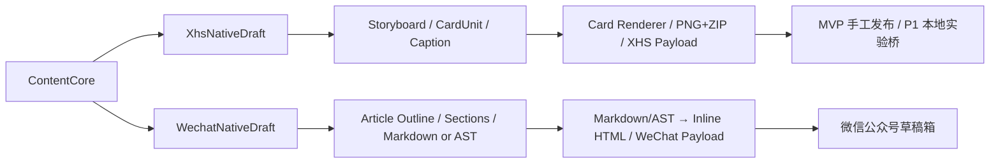
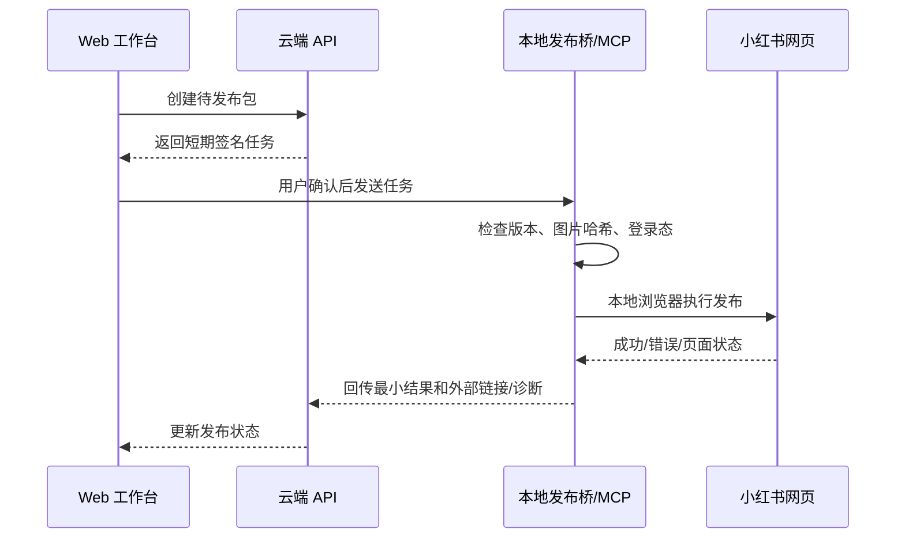
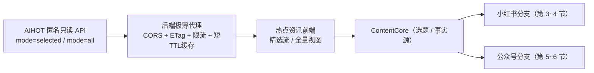

# 双平台排版与发布技术方案

## 1. 总体策略

双平台共享的是事实、观点、Evidence 和素材，不是一篇完整通用文章。内容创作在平台分流后完成，排版与发布适配只处理平台格式和执行：



这里的“平台适配”被缩小为：字段和字数校验、图片尺寸、标签格式、HTML 内联样式、图片上传映射、发布 payload 与平台合规提示。标题、结构、分镜和完整正文属于平台原生创作，不属于发布前换皮。

## 2. Code-2 审计

### 2.1 当前可复用能力

根据本地 `Code-2` 的 README、核心页面、组件与迁移文件，其当前路径为：

```text
项目工作台
→ 内容输入
→ 句子编号/语义分块
→ 人工确认结构化观点
→ 精华版或卡片版编辑
→ 模板与密度预览
→ PNG + ZIP 导出
```

值得保留：

- 原文作为事实源，并尝试保留句子来源；
- 结构化中间层而非一次性生成最终图片；
- 模型失败的本地回退；
- 中间结果可编辑；
- 内容与视觉模板解耦；
- 3:4 预览；
- 1080×1440 PNG 与 ZIP 导出；
- 四套模板和三档密度；
- React/TypeScript 组件和卡片渲染经验。

### 2.2 当前不流畅的根因

1. **入口假设过窄**：假设用户已有完整长文，而本产品入口是多模态灵感与热点。
2. **缺少选题与共享内容核心**：事实、观点和内容价值尚未确认就进入分块和卡片化。
3. **输出模式选择过早**：“精华版/卡片版”在内容未定型时迫使用户决定表现形式。
4. **文本分页不等于视觉分镜**：卡片缺少卡型、叙事目的、原图槽位和页面节奏。
5. **全局模板/密度过粗**：不能逐页选择“封面、步骤、案例、原图”等结构。
6. **质量提示部分不是实际测量**：应基于 DOM 溢出、图片分辨率和真实渲染结果。
7. **证据 ID 存在句子/段落口径不一致风险**：必须统一块级引用。
8. **主页面职责过重**：项目、生成、编辑、预览和导出耦合。
9. **缺少公众号分支与发布适配器**。
10. **当前数据库只覆盖项目、版本、导出包，不足以承载完整链路**。

### 2.3 重构定位

将 Code-2 抽象为“小红书原生分镜与渲染工作区”，输入不再是任意长文字符串，而是：

- `ContentCore`
- `Asset[]`
- `AccountProfile`
- `PlatformPolicySnapshot`
- `ThemeTokens`

输出：

- `XhsNativeDraft`
- `Storyboard`
- `CardUnit[]`
- `RenderedAsset[]`
- `ExportPackage`

Code-2 负责笔记策略落地、分镜编辑、卡片渲染和导出，不负责整个内容项目的素材收集、选题、公众号文章生成或共享版本管理。不建议在旧页面继续叠加全部功能；应抽出纯函数、类型和渲染组件，接入新工作台的小红书分支。

## 3. 小红书原生创作、渲染与导出

### 3.1 推荐流程

```text
ContentCore 已确认
→ 选择小红书笔记策略
→ 生成标题候选与开头钩子
→ 生成图文分镜
→ 用户确认页序、页面角色和卡型
→ 为每页装配原图/信息卡/可选概念图
→ 编写或调整卡片文案
→ 生成短正文与话题
→ 逐页编辑并锁定
→ 真实渲染检查
→ 标题、正文、标签与图片顺序确认
→ PNG/ZIP 导出；P1/Phase 4 实验性发布
```

该流程从共享内容核心直接进入小红书视觉叙事，不经过完整通用长文，也不把公众号章节机械切成卡片。

### 3.2 Storyboard 数据模型

```ts
interface Storyboard {
  id: string;
  platformDraftId: string;
  contentCoreId: string;
  sourceCoreVersion: number;
  strategy: 'knowledge' | 'story' | 'list' | 'opinion' | 'case';
  themeId: string;
  cards: CardUnit[];
}

interface CardUnit {
  id: string;
  order: number;
  role: 'cover' | 'hook' | 'point' | 'steps' | 'comparison' |
        'quote' | 'case' | 'original_image' | 'summary' | 'cta';
  purpose: string;
  blocks: CardBlock[];
  assetSlots: AssetSlot[];
  evidenceRefs: string[];
  locked: boolean;
  layoutVariant: string;
  validation: CardValidation;
}
```

### 3.3 内容与视觉解耦

- 内容：标题、正文块、强调、图注、引用；
- 结构：卡型、顺序、页面角色；
- 视觉：颜色、字体、间距、装饰、图片裁切规则；
- 渲染：HTML/CSS → PNG；
- 导出：图片、正文、元数据、manifest。

主题 token 作用于整组卡片，逐页只允许有限变体，保证统一感。

### 3.4 真实质量检查

- DOM `scrollHeight/clientHeight` 判断溢出；
- 字号和行数基于渲染测量，不用字符数猜测；
- 原图检测像素、长宽比、文件损坏和裁切安全区；
- 每页是否存在未解析素材槽；
- 字体加载完成后再截图；
- 导出图片与预览使用同一渲染组件；
- 视觉回归测试覆盖主题和卡型组合。

### 3.5 导出包

```text
project-name/
  images/
    01-cover.png
    02-hook.png
    ...
  caption.txt
  hashtags.txt
  manifest.json
  sources.md
```

`manifest.json` 记录顺序、尺寸、哈希、生成版本和来源，便于本地发布桥校验。

## 4. 小红书发布通路（P1/Phase 4）

核心 MVP 以可靠导出发布包和手工发布为交付底线；本节的自动执行仅在 P1/Phase 4 以本地实验桥方式灰度，不作为 MVP 上线阻断条件。

### 4.1 已核验能力

`xpzouying/xiaohongshu-mcp` 当前 README 描述了登录状态检查、发布图文、发布视频、搜索与互动等能力；图文发布可使用 HTTP/HTTPS 图片 URL 或本地绝对路径，并更推荐本地路径。

这说明它可作为执行适配器，但不能作为核心业务数据库或平台授权证明。

### 4.2 推荐架构：本地发布桥



安全要求：

- Cookie 和浏览器用户目录只在本地；
- 云端任务令牌短期有效、单次使用；
- payload 带哈希，防止确认后内容被替换；
- 本地桥绑定用户和设备；
- 回传日志脱敏，不上传 Cookie；
- 发布前显示账号、标题、正文、标签、图片顺序；
- 用户可以选择“只打开发布页/只导出”，不强制自动执行。

### 4.3 风险定位

UI 明确标注：

> 实验性第三方连接。它不是小红书官方公开发布接口，可能因页面、登录或平台策略变化而失效，也可能带来账号风险。建议使用前确认平台规则，并保留手工发布方案。

不做：云端账号池、批量无人值守、自动规避风控、无限重试。

### 4.4 幂等与恢复

- 每次确认生成 `publication_intent_id`；
- 本地桥执行前检查是否已有成功回执；
- 不确定是否已发布时进入 `failed_manual`，不自动再次提交；
- 保存截图/页面阶段可作为本地诊断，是否上传由用户选择；
- 标题、图片哈希和创建时间组成去重线索，但不能代替平台外部 ID。

## 5. 公众号原生创作、排版与草稿

### 5.1 公众号稿到排版 HTML

`WechatNativeDraft` 已在公众号分支完成文章策略、标题、文章大纲、分节正文、图片位置和 CTA。排版层只把该平台稿的结构化内容或 Markdown 转换为：

- 微信兼容的标题、摘要和正文结构；
- H2/H3、段落、引用、提示、列表、代码等组件；
- 图片与图注；
- 主题 token 对应的内联样式 HTML。

外部 CSS 不能作为最终依赖，非兼容标签和属性必须清理。排版服务不得从 `ContentCore` 直接补写完整文章，也不得改变事实主张。

### 5.2 doocs/md 的借鉴方式

[doocs/md](https://github.com/doocs/md) 已实现 Markdown 到微信图文的即时渲染、主题、自定义 CSS、多图床和本地草稿等。建议：

- 借鉴其用户体验和兼容性测试思路；
- 评估复用其明确授权、可独立使用的转换模块；
- 不把完整前端应用嵌入核心后端；
- 工作台维护稳定的 `WechatNativeDraft`/AST 契约；转换实现可复用或私有部署开源方案，也可封装外部 API，不必从零发明排版引擎；
- 在许可证、依赖和升级成本审查后再决定代码复用范围。

### 5.3 图片处理

公众号正文图片通常需要先上传到微信可访问的素材/图片接口，再把返回 URL 或 media 标识写入草稿内容。实现时：

1. 扫描 AST 中的图片引用；
2. 检查是否已有该账号下的上传映射；
3. 按内容哈希复用，避免重复上传；
4. 上传并保存 `account_id + asset_hash → wechat_ref`；
5. 替换 HTML 中的图片地址；
6. 组装草稿 payload。

不要把图片大小、格式、数量限制写死在业务代码；用连接器配置和运行时错误校准，并在开发/上线前核对当前官方文档。

## 6. 微信公众号草稿箱通路

### 6.1 推荐实现

官方连接器负责：

- 获取并缓存 `access_token`；
- 检查账号/应用当前接口权限；
- 上传封面与正文图片；
- 新建草稿；
- 获取草稿；
- 更新草稿；
- 在需要时删除草稿；
- 记录官方返回的 `media_id`、错误码和过期信息。

常见接口族包括草稿箱 `draft/add`、`draft/get`、`draft/update` 等，以及素材/图文内图片上传接口。具体 URL、字段、账号资格与限制以接入当日的[微信公众平台官方文档](https://developers.weixin.qq.com/doc/offiaccount/Getting_Started/Overview.html)和实际账号权限返回为准。

### 6.2 连接流程

1. 用户填写 AppID；
2. AppSecret 通过服务端密钥加密保存；
3. 提示用户配置必要的 IP 白名单（如果当前接口要求）；
4. 执行 capability probe；
5. 展示可用能力：素材上传、创建草稿、更新草稿等；
6. 发送测试草稿或仅做只读测试，由用户选择；
7. 连接成功后保存能力快照和核验时间。

不得仅凭“账号类型”在前端猜测权限。

### 6.3 Access Token

- 仅服务端获取和缓存；
- 过期前刷新；
- 多实例使用分布式锁，防止刷新风暴；
- 失败后解析官方错误码，必要时强制失效缓存再取一次；
- 不把 token 返回浏览器或写入普通日志。

### 6.4 草稿 payload

内部从已确认的公众号平台稿构造发布对象，再由连接器映射当前官方字段：

```ts
interface WechatDraftArticle {
  title: string;
  author?: string;
  digest?: string;
  contentHtml: string;
  sourceUrl?: string;
  coverAssetRef: string;
  contentAssetRefs: string[];
  commentPolicy?: string;
}
```

字段映射、必填性和限制独立版本化，避免官方变更污染 `ContentCore` 和公众号平台稿模型。

### 6.5 推送策略

MVP 只推送到草稿箱，不自动群发。成功后展示：草稿标识、时间、使用的 `ContentCore` 版本、公众号平台稿版本和公众号账号，并提示用户前往公众号后台做最终预览和发送设置。

## 7. 核心内容与平台稿的同步

每个平台稿保存：

- `content_core_id`；
- `source_core_version`；
- `platform_draft_version`；
- `generation_strategy_version`；
- `platform_policy_version`；
- `sync_status`：`current | stale | conflict`；
- `user_locked_paths`；
- `generated_at`。

`ContentCore` 变化时不静默覆盖平台稿。系统先把关联稿标记为 `stale`，并显示：

- 新增、删除或修改了哪些核心主张和 Evidence；
- 哪些平台段落/卡片引用了受影响内容；
- 哪些内容已被用户锁定；
- 可以创建新版本的范围；
- 需要用户选择的冲突。

MVP 采用“创建平台稿新版本 + 差异预览 + 用户选择是否替换”，不做自动三方合并。小红书和公众号稿互不作为对方的源稿；一个分支失败或被大幅改写，不影响另一个分支。

## 8. 发布适配器接口

```ts
interface PublicationAdapter {
  platform: 'xiaohongshu' | 'wechat';
  getCapabilities(connectionId: string): Promise<Capabilities>;
  validate(pkg: PublicationPackage): Promise<ValidationResult>;
  publish(intent: ConfirmedPublicationIntent): Promise<PublishResult>;
  getStatus(jobId: string): Promise<PublishStatus>;
  cancel?(jobId: string): Promise<void>;
}
```

`publish` 只接受已经服务端确认并带内容哈希的 intent，不能接受前端随意拼装的正文。

## 9. 监控指标

- 平台原生稿生成、渲染和发布适配成功率及耗时；
- 卡片真实溢出率；
- 图片上传失败率；
- 公众号错误码分布；
- 小红书桥连接/登录/提交各阶段失败率；
- 重复发布拦截次数；
- 人工发布包导出率与自动通路使用率；
- 平台稿被用户修改的块比例、`stale` 提示后的同步选择和锁定内容保留率。

## 10. 最终建议

- 双平台共享 `ContentCore`，不共享完整文章形态；
- Code-2 不推翻，抽取为小红书原生分镜、卡片渲染和导出工作区；
- 公众号先生成独立文章稿，再使用 doocs/md 类开源方案、私有服务或 API 完成 Markdown/AST → HTML，避免重复发明排版引擎；
- 平台适配只负责格式、资源上传、payload、校验和发布执行；
- `ContentCore` 更新只标记平台稿过期并提供差异，不覆盖人工编辑；
- 小红书第三方执行默认本地、实验性、强确认；
- 两个平台都必须保留导出/人工发布退路。

## 11. AI 热点资讯采集（全量热点视图）

> 本节补充「内容采集端」的工程要求，重点抽取其中**需要后端工程师实现的部分**。对应的高保真原型与完整移交口径见 `Code-10-ai-hot-information-demo/Doc/` 下的 `prototype-B-杂志编辑风-最终版.html`、`05-开发任务移交提示词.md`、`00-设计需求摘要.md`、`02-视觉风格方案-版本B.md`。本节仅摘录后端约定，并与本方案的双平台链路衔接；前端视觉还原要求不在本方案重复，以 `02-视觉风格方案-版本B.md` 为唯一权威。

### 11.1 定位：采集端是 ContentCore 的上游

本工作台的完整链路为「采集 → 创作 → 排版 → 发布」。AI 热点资讯平台（基于 AIHOT 匿名只读 API）承担**采集 / 选题**职责，其输出可作为 `ContentCore` 的选题来源与事实源之一。本次在原型新增的**「全量」菜单栏**，让采集端覆盖**全部公开热点数据**（`mode=all`），与既有的「精选」编辑策展流（`mode=selected`）互补，满足“既看编辑精选、也能查全量”的需求。



### 11.2 全量视图与精选流的关系

| 维度 | 精选流 | 全量视图（本次新增） |
|------|--------|----------------------|
| 对应 API | `GET /api/v1/items?mode=selected` | `GET /api/v1/items?mode=all` |
| 数据性质 | 编辑高门槛策展池 | 全量公开池，未经策展 |
| 前端入口 | 顶部导航「精选」 | 顶部导航「全量」（新增菜单项） |
| 卡片结构 | `.card` / `.grid` / `.qchip` 等 | **完全复用**，视觉一致 |
| 后端接口 | `/api/proxy/items` | **复用同一代理路由，仅 `mode` 不同** |

> 二者**共用同一 `/api/proxy/items` 转发路由**，不新增独立端点；前端仅切换 `mode` 参数与导航激活态。其余栏目（热点榜 / 检索 / 日报 / 事件详情）的结构、样式、内容不在本次改动范围内。

### 11.3 后端代理：复用与新增要求

- [ ] 全量视图复用既有 `/api/proxy/items`，透传 `mode=all`、`window=24h|7d`、`category=<slug>`、`q=<关键词>`、`by=timeline|published`、`limit`、分页 `cursor`。
- [ ] **来源筛选仍为客户端本地过滤**：AIHOT 接口无 `source` 参数，全量池来源更杂，来源筛选须在前端按返回 `source.name` 做本地派生，**请求串不得携带来源参数**。
- [ ] 缓存与限流：同端点轮询间隔 ≥ 60s（AIHOT 要求）；全量池数据量更大，建议后端短 TTL（5~15 min）缓存，前端读缓存。
- [ ] ETag / `If-None-Match` 复用：全量视图与精选流共用缓存时，键须区分 `mode`，避免串扰。
- [ ] 错误降级：上游超时 / 限流 / 空结果时，全量视图展示中性空态（沿用原型 `allEmpty` 文案），不白屏。

### 11.4 数据契约（与精选流一致）

复用 `05-开发任务移交提示词.md` 第三节的 `items` 单条约定：

```jsonc
{
  "title": "string",                 // 标题
  "summary": "string",               // 摘要
  "reason": "string",                // 推荐理由（编辑撰写；全量池多为空，须做空值降级）
  "source": { "name": "string" },    // 来源名称（来源本地过滤依据）
  "publishedAt": "ISO8601",          // 第三方原文发布时间
  "discoveredAt": "ISO8601",         // 被 AIHOT 发现时间
  "links": {
    "aihot": "url",                  // 平台内主链接
    "original": "url"                // 原文跳转（必须透传，用于署名核对）
  },
  "score": "number|null",            // 返回字段之一；卡片不展示精确数值（见 11.5 显示决策）
  "rank": "number|null",
  "links": { "story": "url|null" }   // 事件脉络入口（hot-topics 部分条目携带）
}
```

> **显示决策（必须沿用质量评审结论）**：资讯卡片**不展示精确数值评分**（避免杜撰热度观感）；`rank` 仅热点榜使用；`reason` 在全量池可能为空，须有降级展示。上线前务必抓一条真实 `mode=all` 响应，校正字段名 / 类型 / slug 取值。

### 11.5 五项检索能力 → API 映射（诚实边界，不可突破）

| # | 能力 | 实现方式 | UI 类型标注（必须显示） |
|---|------|----------|--------------------------|
| 1 | 关键词搜索 | `q` 参数 | 直接 API 能力 |
| 2 | 分类筛选 | `category`（模型 / 产品 / 论文 / 行业 / 技巧） | 直接 API 能力 |
| 3 | 时间范围 | `window` + `by` 参数 | 直接 API 能力 |
| 4 | 来源筛选 | 按 `source.name` 客户端过滤 | **「本地过滤 · 客户端派生」**（非 API 参数） |
| 5 | 智能 / 语义检索 | 热点榜编辑智能 + stories AI 综述 + 精选策展 + 推荐理由 | **「智能聚合层 · 非语义检索」**（非向量语义搜索） |

> 第 4、5 项**不是独立 API 端点**。全量视图拼装请求串时，来源与智能**不得进入 API 请求**，只能作为本地 / 聚合行为；这与精选流完全一致。

### 11.6 约束红线（与双平台链路同等重要）

1. **合规授权**：数据来自 AIHOT 匿名只读 API，**署名 ≠ 授权**。个人非商业 demo 可免费使用；任何对外商业化 / 收费 / 数据转售 / 公开镜像 / 白标，须先取得 AIHOT 书面授权（联系 `wzglyay@virxact.com`）。代码与界面须保留「数据来源：AIHOT」署名与原文跳转。
2. **数据诚实边界（不可删减）**：来源「本地过滤」、智能「非语义检索」、热点榜「—」不杜撰热度、资讯卡不展示虚假精确评分。这是设计评审明确结论，也是避免误导用户的关键。
3. **不落库 / 不改写**：代理只转发 + 缓存，不存储或改写来源内容；来源署名随响应透传。
4. **调用频率**：同端点轮询 ≥ 60s；资讯非秒级新鲜度，优先缓存而非实时硬拉。
5. **上线前数据核对**：抓一条真实 `mode=all` 响应，校正字段名 / 类型 / slug 取值，以真实响应为最终事实来源。

### 11.7 与双平台链路的衔接

- 全量热点视图中的选题一旦进入 `ContentCore`，即走第 3~6 节的小红书 / 公众号原生创作与发布链路；采集端**不负责平台适配与发布执行**。
- 后端代理建议与第 4 节「本地发布桥」同域部署，统一 CORS、限流与安全边界，避免多套跨域策略。
- 后端代理的完整规范（目录结构、错误处理、提交要求、验收清单）见 `Code-10-ai-hot-information-demo/Doc/05-开发任务移交提示词.md`，本方案不再赘述。
