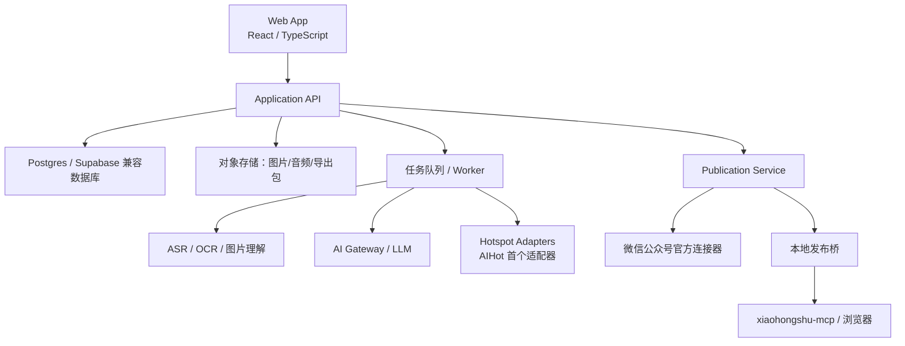

# 系统架构、数据模型与研发计划

## 1. 架构目标

首版采用“Web 工作台 + 服务端 API + 异步任务 + 对象存储 + 连接器/本地桥”的分层架构。核心内容状态不依赖某一个模型或发布平台。



## 2. 技术边界

### Web

可沿用 Code-2 的 React、TypeScript、Tailwind、TanStack Router/Start 经验，但建议将创作工作台从现有单页中拆出：

- `inspiration` 路由群；
- `hotspots` 路由群；
- `creation` 路由群；
- `publisher` 路由群；
- 共享 `content-model` 和 `renderer` 包。

### 后端

- 业务 API：REST 或类型安全 RPC，首版不要同时维护过多协议；
- 数据库：Postgres/Supabase 兼容；
- 文件：S3/R2/兼容对象存储；
- 异步：队列 + Worker；
- AI：统一网关；
- 发布：连接器接口；
- 实时：任务状态轮询起步，P1 再接 SSE/WebSocket。

## 3. 数据模型

下面是逻辑模型，具体字段可根据现有迁移风格落地。

### 3.1 用户和连接

#### `workspaces`

- `id`
- `owner_id`
- `name`
- `timezone`
- `created_at`

#### `workspace_members`

- `workspace_id`
- `user_id`
- `role`：owner/editor/viewer

#### `platform_connections`

- `id`
- `workspace_id`
- `platform`：wechat/xiaohongshu
- `display_name`
- `status`：connected/degraded/requires_action/disconnected
- `secret_ref`：仅指向密钥存储，不保存明文
- `capabilities_json`
- `last_probe_at`
- `created_at`

### 3.2 灵感和资产

#### `inspirations`

- `id`
- `workspace_id`
- `recorded_at`
- `text_raw`
- `text_normalized`
- `type_id` nullable
- `user_tags_json`
- `ai_tags_json`
- `board_position_json`
- `processing_status`
- `created_at`
- `updated_at`

#### `assets`

- `id`
- `workspace_id`
- `inspiration_id`
- `kind`：image/audio/file
- `storage_key`
- `sha256`
- `mime_type`
- `bytes`
- `duration_ms` nullable
- `width/height` nullable
- `privacy_scope`
- `created_at`

#### `asset_derivatives`

- `id`
- `asset_id`
- `kind`：thumbnail/ocr/transcript/caption/waveform
- `content_json`
- `model_ref`
- `status`
- `created_at`

#### `inspiration_types`

- `id`
- `workspace_id` nullable
- `slug`
- `label`
- `color_token`
- `icon`
- `sort_order`
- `archived_at`

#### `daily_boards`

- `id`
- `workspace_id`
- `board_date`
- `layout_version`
- `created_at`

灵感不直接依赖日白板，白板是日期视图。`inspirations.recorded_at` 决定默认所属日期，允许用户调整。

### 3.3 热点

#### `hotspot_sources`

- `id`
- `workspace_id` nullable
- `adapter_id`
- `adapter_version`
- `display_name`
- `config_json`
- `enabled`
- `last_health_json`

#### `hotspot_snapshots`

- `id`
- `source_id`
- `fetched_at`
- `query_json`
- `raw_payload_uri`
- `payload_hash`
- `status`

#### `hotspot_items`

- `id`
- `snapshot_id`
- `external_id`
- `title_raw`
- `summary_raw`
- `summary_ai`
- `source_url`
- `source_published_at`
- `rank`
- `heat_evidence_json`
- `freshness_status`
- `normalized_topics_json`

AI 摘要和聚类不覆盖原始字段。

### 3.4 创作

#### `creation_projects`

- `id`
- `workspace_id`
- `name`
- `status`
- `primary_date` nullable
- `account_profile_id` nullable
- `created_by`
- `created_at`
- `updated_at`

`primary_date` 保存日期白板主入口，但项目也可由搜索、最近灵感、热点或自定义选题直接创建。

#### `project_sources`

- `project_id`
- `source_type`：inspiration/hotspot/custom/imported_article
- `source_id` nullable
- `snapshot_id` nullable
- `selected_excerpt_json`
- `usage_scope`：evidence/publishable/reference_only

#### `topic_briefs`

- `id`
- `project_id`
- `version`
- `content_json`
- `relation_analysis_json`
- `status`
- `created_at`

#### `content_cores`

- `id`
- `project_id`
- `topic_brief_id`
- `version`
- `core_json`：受众、问题、承诺、主张、事实、Evidence、案例、素材、约束
- `material_snapshot_ids_json`
- `locked_paths_json`
- `created_by`
- `created_at`

`content_cores` 不保存完整平台正文、平台标题、分镜、CTA 或排版。关键主张和事实引用稳定的 `evidence_id`。

#### `platform_drafts`

- `id`
- `project_id`
- `content_core_id`
- `platform`：xiaohongshu/wechat
- `source_core_version`
- `version`
- `draft_json`
- `plain_text` nullable
- `sync_status`：current/stale/conflict
- `generation_strategy_version`
- `platform_policy_version`
- `user_locked_paths_json`
- `created_by`
- `created_at`
- `updated_at`

小红书 `draft_json` 保存笔记策略、标题、钩子、正文、标签与分镜引用；公众号 `draft_json` 保存文章策略、标题、大纲、分节正文、图片位置与 CTA。两者引用同一 `ContentCore`，但互不作为源稿。

当 `content_cores.version` 增加时，服务端将旧来源版本的平台稿标记为 `stale`。MVP 同步方式是创建新平台稿版本并展示差异，不静默覆盖 `user_locked_paths_json`；块级三方合并延后到 P2。

### 3.5 小红书和公众号

#### `storyboards`

- `id`
- `platform_draft_id`：必须引用 `platform=xiaohongshu` 的平台稿
- `content_core_id`
- `source_core_version`
- `strategy`
- `theme_id`
- `version`
- `cards_json`
- `validation_json`

#### `rendered_assets`

- `id`
- `storyboard_id`
- `card_id`
- `storage_key`
- `sha256`
- `width/height`
- `renderer_version`

#### `publication_packages`

- `id`
- `project_id`
- `platform`
- `platform_draft_id`
- `platform_draft_version`
- `content_core_id`
- `source_core_version`
- `manifest_json`
- `content_hash`
- `expires_at`

发布包必须绑定已确认的平台稿版本；公众号草稿箱不能直接接收 `ContentCore`，小红书发布包也不能由公众号稿派生。

#### `publication_jobs`

- `id`
- `package_id`
- `connection_id`
- `intent_id`
- `status`
- `external_id`
- `error_code`
- `error_detail_safe`
- `attempt_count`
- `last_attempt_at`
- `created_at`

## 4. Skill 插件协议

### 4.1 Manifest

```json
{
  "id": "hotspot.aihot",
  "version": "0.1.0",
  "kind": "hotspot_source",
  "displayName": "AI 热点",
  "capabilities": ["list", "detail"],
  "configSchema": {},
  "outputSchema": "HotspotPage",
  "networkDomains": ["aihot.virxact.com"],
  "requiresUserSecret": false,
  "license": "verify-before-production"
}
```

### 4.2 运行约束

- 网络域名白名单；
- 超时、速率、最大响应体积；
- 原始数据不得直接渲染为 HTML；
- 输出必须经过 schema 校验和字段长度限制；
- 失败返回可观测错误，不泄露密钥；
- 自定义 Skill 不允许直接执行任意用户代码；
- Skill 版本变化触发兼容性测试。

### 4.3 统一 `HotspotItem`

```ts
interface HotspotItem {
  id: string;
  source: string;
  externalId: string;
  title: string;
  summary?: string;
  sourceUrl?: string;
  sourcePublishedAt?: string;
  capturedAt: string;
  rank?: number;
  heatEvidence?: unknown;
  freshness: 'fresh' | 'aging' | 'expired' | 'unknown';
}
```

## 5. API 草案

### 灵感

- `POST /api/inspirations`
- `GET /api/inspirations?date=YYYY-MM-DD`
- `PATCH /api/inspirations/:id`
- `POST /api/inspirations/:id/process`
- `POST /api/inspirations/bulk-layout`
- `POST /api/assets/presign`
- `POST /api/assets/complete`

### 热点

- `GET /api/hotspots/sources`
- `POST /api/hotspots/sources/:id/refresh`
- `GET /api/hotspots/items`
- `GET /api/hotspots/items/:id`
- `POST /api/hotspots/items/:id/attach-to-project`
- `GET /api/hotspots/health`

### 创作

- `POST /api/projects`
- `POST /api/projects/:id/sources`
- `POST /api/projects/:id/relation-analysis`
- `POST /api/projects/:id/topic-candidates`
- `POST /api/projects/:id/content-core`
- `GET /api/content-cores/:id`
- `PUT /api/content-cores/:id`
- `GET /api/content-cores/:id/versions`
- `POST /api/projects/:id/platform-drafts/xhs`
- `POST /api/projects/:id/platform-drafts/wechat/outline`
- `POST /api/projects/:id/platform-drafts/wechat/draft`
- `GET /api/platform-drafts/:id`
- `PUT /api/platform-drafts/:id`
- `GET /api/platform-drafts/:id/sync-status`
- `POST /api/platform-drafts/:id/sync`
- `GET /api/projects/:id/versions`

`PUT /api/content-cores/:id` 表示基于当前 Core 创建一个新版本，而不是原地覆盖既有版本；新版本写入后触发关联平台稿的同步状态检查。`sync` 默认创建新的平台稿版本，参数必须说明基于哪个核心版本、保留哪些锁定路径；不得原地覆盖已有人工作痕迹的平台稿。

### 发布

- `POST /api/connections/:id/probe`
- `POST /api/publication-packages`
- `POST /api/publication-jobs/validate`
- `POST /api/publication-jobs/:id/confirm`
- `POST /api/publication-jobs/:id/cancel`
- `GET /api/publication-jobs/:id`
- `POST /api/bridge/tasks/claim`
- `POST /api/bridge/tasks/:id/result`

所有写操作带 workspace 权限校验；发布确认带平台稿内容哈希和幂等键。

## 6. 异步任务

任务类型：

- `asset.transcribe`
- `asset.ocr`
- `asset.understand_image`
- `hotspot.refresh`
- `project.relation_analysis`
- `project.generate_topics`
- `project.generate_content_core`
- `project.generate_xhs_draft`
- `project.generate_wechat_outline`
- `project.generate_wechat_draft`
- `project.check_core_sync`
- `project.create_platform_version`
- `publication.render_xhs_assets`
- `publication.render_wechat_html`
- `publication.upload_assets`
- `publication.create_wechat_draft`

任务要求：

- `job_id`、`attempt`、`input_hash`、`model_version`；
- 可重试与不可重试错误分离；
- 超时取消；
- 进度是可选信息，最终状态必须可靠；
- 任务输出写新版本，不覆盖用户锁定内容；
- 平台任务明确记录 `content_core_id/source_core_version/platform_draft_id`。

## 7. 安全与隐私

- AppSecret、ASR/LLM key 使用密钥管理服务；
- 数据库行级权限或服务端 workspace 权限；
- 对象存储短期签名 URL；
- 上传文件做 MIME、大小、病毒/恶意内容检查；
- 图片 EXIF 默认清理敏感位置；
- 原文、音频和图片的删除要能级联清理派生数据；
- LLM 数据共享开关默认保守；
- 审计日志记录“谁在何时发布了哪个版本”；
- 管理后台不允许直接查看第三方 Cookie。

## 8. 测试策略

### 单元测试

- 日期滚轮边界、闰年、月份天数；
- 白板布局与整理；
- `ContentCore` schema、Evidence 引用与平台稿生成映射；
- 热点 schema 归一化；
- 相关性加权计算；
- 幂等键和状态转换；
- 公众号 payload 映射；
- 卡片溢出测量。

### 集成测试

- 上传→ASR/OCR→素材可引用；
- AIHot 缓存、熔断和手工热点录入退路；
- 素材装配→选题确认→`ContentCore`；
- 同一 `ContentCore`→小红书原生分镜稿；
- 同一 `ContentCore`→公众号文章大纲与分节稿；
- 核心版本更新→平台稿 `stale`→差异预览→创建新版本；
- 锁定平台内容在同步时不被覆盖；
- 公众号 capability probe→平台稿 HTML→草稿；
- 小红书平台稿→分镜 PNG/ZIP→本地桥任务领取与回执；
- 失败重试不产生重复发布。

### 视觉回归

- 每种主题×卡型；
- 不同长度文本；
- 缺图、低清图、超长标题；
- 中英文、emoji、标点；
- 字体未加载和加载完成；
- 1080×1440 输出与浏览器预览一致。

### 用户验收

- 记录灵感；
- 按日期定位；
- 多选进入创作；
- 低相关热点继续创作；
- 编辑核心内容骨架并确认 Evidence；
- 从核心内容创建小红书分镜，逐页锁定和重新生成；
- 生成公众号草稿；
- 导出小红书发布包；
- 发布失败并恢复。

## 9. 研发阶段

### Phase 0：架构和用户验证（1–2 周）

- 访谈 5–8 名双平台创作者；
- 验证“共享核心内容、平台分流后原生成稿”是否比“完整母稿再适配”更易理解；
- 设计首页、记录、日期白板、辅助创作入口、素材篮和创作要点原型；
- 核验微信账号、AIHot 服务和 `xiaohongshu-mcp` 风险；
- 抽取 Code-2 的 renderer、card model 和 export 能力。

**出口条件**：用户能完成从灵感到选题及核心内容确认；平台路径与连接能力边界明确。

### Phase 1：灵感、热点、选题与 ContentCore（3–4 周）

- 首页、文字/图片/音频记录和对象存储；
- ASR/OCR/图片理解异步任务；
- 日期滚轮、日白板、最近灵感/搜索/直接选题入口；
- AIHot 列表、缓存、详情和手工录入退路；
- 素材篮、相关性分析、候选选题；
- `ContentCore` 编辑、Evidence、版本和锁定。

### Phase 2：公众号原生文章与草稿箱（3–4 周）

- 文章策略、标题候选、公众号文章大纲；
- 分节成稿、全文编辑、图片位置与锁定；
- 复用/私有部署开源方案或 API 的 Markdown/AST → 内联 HTML；
- capability probe、图片上传映射和官方草稿箱；
- 公众号稿版本及 Core 更新差异提示。

### Phase 3：小红书原生分镜与安全导出（3–4 周）

- 笔记策略、标题/钩子和 Storyboard；
- 卡片逐页编辑、原图装配和真实溢出检查；
- 1080×1440 PNG、ZIP、caption、hashtags 和 manifest；
- 小红书稿版本及 Core 更新差异提示；
- 先以可靠导出作为 MVP 安全退路。

### Phase 4：小红书本地发布桥与灰度（2–3 周）

- 本地发布桥、登录态和实验性风险提示；
- 幂等、状态机、内容哈希和错误诊断；
- 导出/手工发布退路；
- 10–20 名用户灰度；
- 根据真实使用决定是否扩大第三方自动执行。

### Phase 5：P1/P2

- 跨日期素材篮、账号画像与效果回流；
- 移动端拍摄/录音；
- 星云探索和更多受控热点 Skill；
- 块级差异同步/三方合并；
- 团队协作和正式排期。

## 10. 关键风险与应对

| 风险 | 等级 | 应对 |
|---|---:|---|
| 小红书第三方通路失效或账号风险 | 高 | 本地桥、人工发布包、明确实验性 |
| 微信权限/字段变化 | 高 | capability probe、连接器版本化、上线复核 |
| AIHot 服务不稳定或条款不清 | 中高 | 缓存、熔断、服务条款核验、手动热点录入退路 |
| AI 生成事实错误 | 高 | Evidence 引用、待核验标记、发布前检查 |
| 图片版权/隐私 | 高 | 来源、授权字段、EXIF 清理、原图优先 |
| 过度复杂导致创作摩擦 | 高 | 快速记录、分阶段渐进披露、可跳过 AI |
| Code-2 重构范围失控 | 中 | 先抽模型/渲染/导出，禁止同时重写全部 UI |
| 任务重复执行 | 高 | 幂等键、外部 ID、状态机、人工恢复 |

## 11. 交付物清单

- 产品原型和交互说明；
- 数据库迁移与种子数据；
- Skill manifest 与 AIHot adapter；
- ASR/OCR/图片理解任务；
- TopicBrief、ContentCore 与双平台原生稿 schema；
- XHS 原生 Storyboard、Card Renderer 与导出包；
- WeChat 原生文章工作区与可替换的 HTML 排版适配器；
- 平台连接器与 capability probe；
- 发布状态机和审计日志；
- 测试数据、视觉回归基线、运维手册。

系统验收标准见：[07-MVP验收标准与用户研究计划.md](./07-MVP验收标准与用户研究计划.md)。
